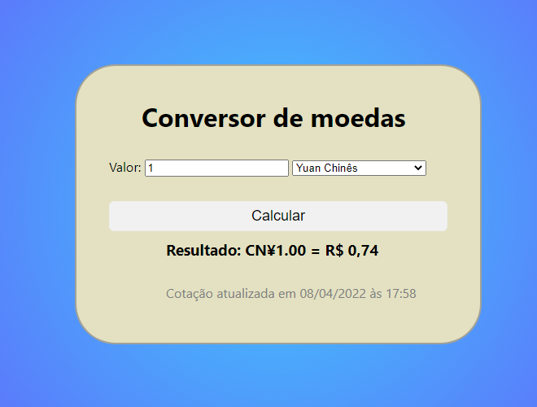

# ConversorDeMoeda
Descrição
Projeto desenvolvido para treino em HTML, CSS e JavaScript,

O objetivo do conversor de moeda é fazer a conversão direta do valor de uma moeda para outra.
A conversão acontece de: real para dólar, real para euro, para isso foi implementado uma interface, que pega a cotação atual da moeda e faz a conversão, facilitando a vida do usuário.

